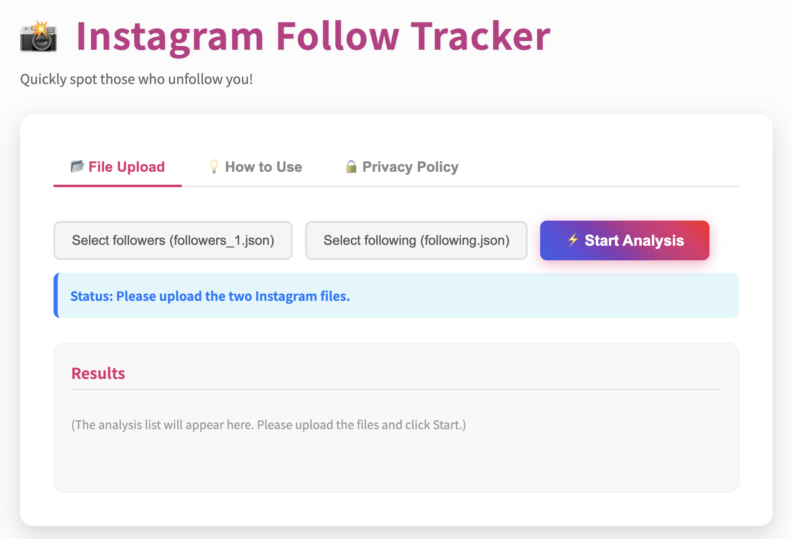
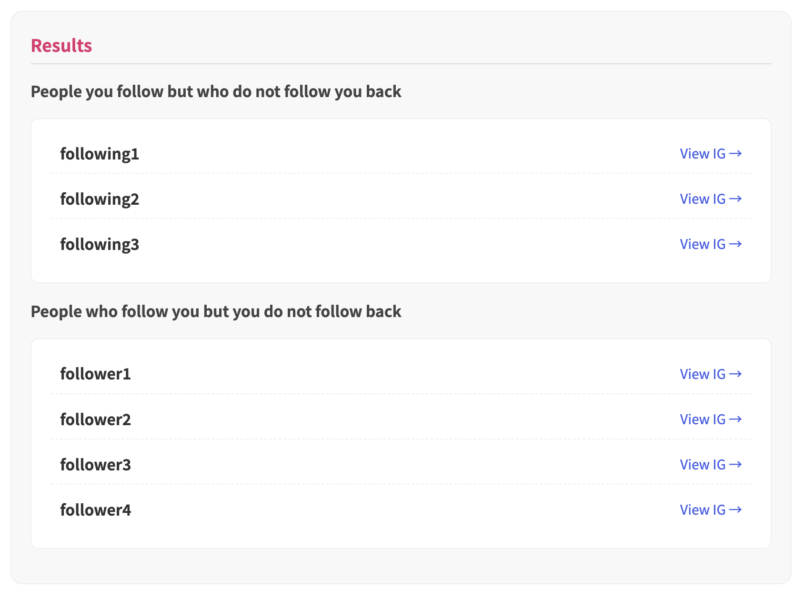

# Instagram Follow Report

The [website](https://chia-wei-wu.github.io/instagram-follow-report/) allows you to analyze your Instagram follower and following without entering any instagram account or password.
With just three steps, you can quickly identify who is not following you back.

## How to Use
Three Steps to Quickly Compare Your Lists:
1. Find the Specified File
    - Go to your profile page in Instagram and tap the icon in the top right corner Menu (≡).
    - Google Download，click Download your information → Create export → Choose a profile → Expert to device.
2. Customize Download Format
    - Set the following parameters: Customize Information to Only Followers and Following, Data Range to All Time, and Format to JSON.
    - Click Start export. Instagram will prepare the file and notify you via email when it’s ready for download.
3. Upload File
    - After downloading and unzipping, navigate to the files connections → followers_and_following → followers_1.json and following.
    - Upload the following files to the designated location.
4. Click Start Analysis

## Results

Here is the example of the result.

## License
This repo is published under the GPL-3.0 License.